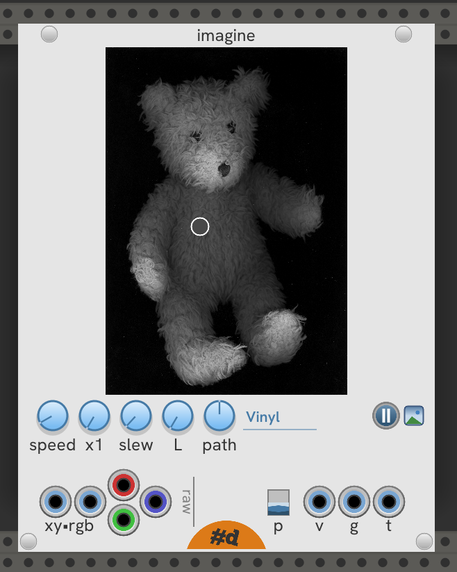

# pachde-One

This is a work in progress.

The first VCV Rack plugin for pachde (#d).

All pachde-One modules have light, dark, and high contrast themes. Right click to choose a theme.
They also come with caps on the screws for an elegant look. Screws are removable.

## Null

_Status_: Complete

A Minimalist resizable blank panel. All blank, no advertising.

- Resizable - Drag the left and right edges when the overlay appears.

Select options in the module menu:

- Removable screws.
- Light, Dark, and High Contrast themes.
- Customizable panel color. Enter using standard hex text color format: **`#`**_hex-rgb_.
- Glow in the dark. The panel lights up in a darkened room.

## Info

_Status_: Basic text entry in menu

A Minimalist resizable patch notes panel.

- Resizable - Drag the left and right edges when the overlay appears.

Select options in the module menu:

- Removable screws.

- Light, Dark, and High Contrast themes.

- Bright text panel in a dark room.

- Customizable text and panel colors.
Enter using standard hex text color format: **`#`**_hex-rgb_.

- Customizable font and font size.

## Imagine

_Status_: MVP nearly complete

An eccentric source of volage, gates, and triggers using an image.
You can think of it as a sequencer or image sampler.

Load an image and generate voltages, gates, and triggers as the image is scanned a read head.
Click on the image to set the position of the read head.
Drag to scrub.

Features:

- All knobs are clicky knobs.
Click on a knob to increment the value by a useful unit.
Ctrl+Click to decrement (Cmd+Click on Mac).

- Open an image by clicking the Picture button next to the Play/Pause button.

- Adjust the speed of the read head with the **speed** knob.
The next **x?** knob multiplies the **speed** by **x1** - **x10** times.

- If the output is janky, smooth it out with a higher **slew** rate.

- Choose the color component at the read to output to **v**oltage, and analyze for **g**ates and **t**riggers.
  The knob has a dynamic display that shows the current color component:

  | Component | Description |
  | -- | -- |
  | **L** | Luminance |
  | **S** | Saturation |
  | **H** | Hue |
  | **R** | Red component |
  | **G** | Green component |
  | **B** | Blue component |
  | **a** | Alpha (transparancy) |

  Alpha isn't useful for most images.
  Only PNGs with transparency will have an effect.
  Everything else will ouput a steady maximum voltage.

- Choose a **path** to move through the image:

  | Path | Description |
  | -- | -- |
  | **Scanline** | Simple left-to right, top to bottom scan. |
  | **Bounce**   | Travel in straight lines and bounce at the edges. Bounces are randomly very slightly askew from a perfect reflection. |
  | **Vinyl**    | (my favorite) Spin in like a record (baby), then spin back out. |
  | **Wander**   | Just wander around the image to see what you can find. |
  | **XY Pad**   | No automatic movement of the read head. Reads from where you click. Drag the mouse to scrub through the image. With a carefully prepared image, you can get precise voltages for controlling a patch. |

  To use Imagine as an plain XY Pad, set **path** to **XY Pad** without an image.
  To close an image after you've opened one, cancel out of the **Open image** dialog.

- Start and stop the read head with the **Play/Pause** button.

- Select an image using the **Picture** button.

- Imagine has a variety of outputs.
Raw unipolar outputs for **x**, **y**, and pixel **R**, **G**, and **B** values are on the left,
and calculated outputs for **v**oltage **g**ate and **t**riger to the right.

- Choose polarity of voltages with the **p** switch.
Switches calculated outputs between -5 to +5v and 0 to 10V.
Also sets the coordinate system for the plain XY Pad.
