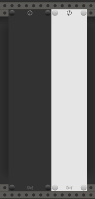
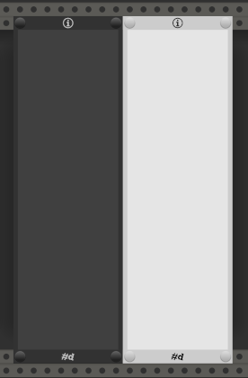
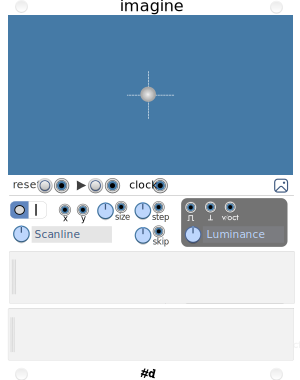

# pachde-One

This is a work in progress.

The first VCV Rack plugin for pachde (#d).

All pachde-One modules have light/dark themes. Right click to choose a theme.

All pachde-One modules come with caps on the screws for an elegant look.

## null

Status: Complete

A Minimalist resizable blank panel with light and dark themes.

## info

Status: Text editing,and options NYI.

Resizable panel with editable text and light and dark themes.

## imagine

Status: Planned

An eccentric source of v/oct, gates, and triggers using an image. You can think of it as a sequencer or image sampler.

Load an image and generate voltages, gates, and triggers as the image is scanned by one or more read heads.

