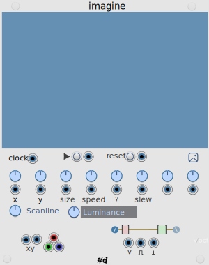

# pachde-One

This is a work in progress.

The first VCV Rack plugin for pachde (#d).

All pachde-One modules have light, dark, and high contrast themes. Right click to choose a theme.
They also come with caps on the screws for an elegant look. Screws are removable.

## null

_Status_: Complete

A Minimalist resizable blank panel with light and dark themes, removable screws, and custom color.

## info

_Status_: Basic text entry in menu

Resizable panel with editable text and light and dark themes.

## imagine

_Status_: MVP nearly complete

An eccentric source of volage, gates, and triggers using an image. You can think of it as a sequencer or image sampler.

Load an image and generate voltages, gates, and triggers as the image is scanned by one or more read heads. Click on the image to set the position of the read head.

