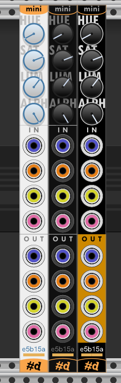

# Copper-mini

Color picker with modulation and outputs.

**See also:** [All pachde-One modules](index.md)

Here's a sample of the module in Light, Dark, and High Contrast themes.

Twist the H knob to select the color's hue.
Twist the S and L buttons to select the corresponding color component.

In addition to dragging to twist a knob, all the knobs are clicky. Click any knob to advance the value by increments. Ctrl+Click (Cmd+Click on Mac) to decrement.

Below the outputs, the selected color is displayed opaquely on the left half, 
and on the right side it shows the modulated color.

The modulated hex color text appears above the color sample.
Right click to find a menu option to copy that value for use in another module.

## Copper vs Copper-mini

Copper and Copper-mini share the same underlying color module. They present a slightly different UI and selection of output ports, but optherwise behave the same, including as expander for Null and Info.

## As expander

Both Copper and Copper-mini work as expanders to [Null](Null.md) for choosing its panel color -- even live-modulating it for some excitement.
See [Null](Null.md) for more details on the entertainment value of this configuration.

Copper is also an expander for [Info](Info.md) for choosing its colors, configured in the module menu.

Null and Info both allow you to turn off using Copper as an expander.

## Inputs

| Jack Color | Color component |
| -- | -- |
| Blue | Hue component |
| Orange | Saturation (chroma) |
| Yellow | Lightness component |
| Pink | Alpha |

All inputs are relative modulation of the knob setting, except when connected to the outputs of another Copper or Copper-mini. When the outputs of one are connected to the inputs of another, the source module is the absolute source of values for the connected one. They are completely synchronized.

This can be useful when animating Null and Info. You can extend Null and Info with a less intrusive Copper-mini driven by a full Copper elsewhere in the patch.

## Outputs

All output ports represent the modulated color when any input ports are connected.

| Jack Color | Color component |
| -- | -- |
| Blue | Hue component |
| Orange | Saturation (chroma) |
| Yellow | Lightness component |
| Pink | Alpha |

## Options

| Option | Description |
| -- | -- |
| Theme | Choose Light, Dark, or High Contrast theme, and options for following the Rack dark panels setting, and the theme to use when doing so. |
| Palette color | Choose the color from a palette of named colors. |
| Copy hex color | Copies the hex code of the selected color to the clipboard. You can use this to paste into most color inputs of other Rack modules (including all of pachde-One). |
| Paste hex color | If the clipboard contains a hex color, changes the chosen color. |

