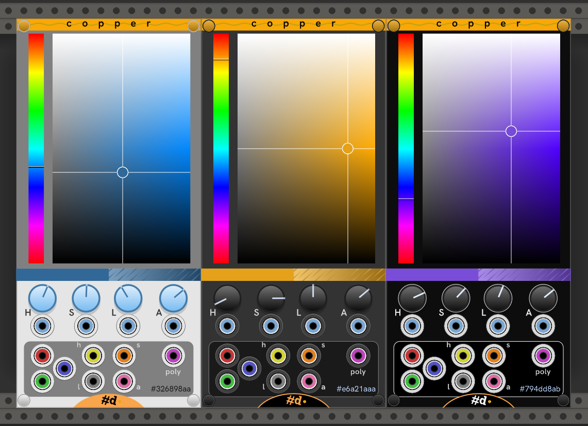

# Copper

A color picker with modulation and outputs

Click on the Hue selector or twist the H knob to select the color's hue.

Click in the Lightness/Saturation gradient to set the lightness (verical) and saturation (horizontal) of the color. Or, twist the S and L buttons to select the corresponding color component.

In addition to draggin to twist a knob, all the knobs are clicky. Click any knob to advance the value by increments. Ctrl+Click (Cmd+Click on Mac) to decrement.

Below the colored pickers, the selected color is displayed opaquely on the left half, as if alpha is 1. On the right side it is laid over a white to black gradient with 50% gray texture, so you can see how it overlays with transparency. If you don't see a gradient or texture, the color has little to no transparancy (alpha close to 1).

If the color is modulated by CV inputs, the color bar is split, with the unmodulated chosen color on top, and the modulated color below.

The selected, unmodulated hex color is shown on the outputs section.
Right click to find a menu option to copy that value for use in another module.

## As extender

Copper works as an extender to [Null](Null.md) for choosing it's panel color -- even live modulating it for some excitement.
See [Null](Null.md) for more details on the entertainment value of this configuration.

Copper is also an extender for [Info](Info.md) for choosing it's colors, configured in the Info menu.

## Inputs

H (hue), S (saturation, AKA chroma), L (lightness), and A (alpha, AKA transparency) inputs modulate the corresponding component of the chosen color.

## Outputs

All output jacks represent the modulated color when any input jacks are connected.

| Jack | Jack Color | Color component |
| -- | -- | -- |
| R | Red | Red component |
| G | Green | Green component |
| B | Blue | Blue component |
| h | Yellow | Hue component |
| s | Orange | Saturation (chroma) |
| l | Gray | Lightness |
| a | Pink | Alpha |
| poly | Magenta | All of the above on separate channels of one polyphonic output in the order H, S, L, A, R, G, B |

## Options

| Option | Description |
| -- | -- |
| Screws | Add or remove the screw caps. |
| Theme | Choose Light, Dark, or High Contrast theme. |
| Panel color | Enter a standard rack #_hex_ code for a custom color to override the theme. Even the screw caps adopt your color!. |
| Glow in the dark. | The panel stays bright in a darkened room, with a glow that follows VCV Rack's Light bloom setting. |
| Copy hex color | Copies the hex code of the selected color to the clipboard. You can use this to paste into most color inputs of other Rack modules (including all of pachde-One). |

