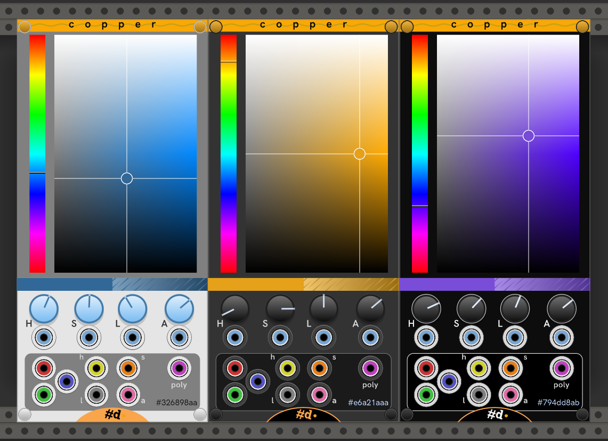

# Copper

Color picker with modulation and outputs.

**See also:** [All pachde-One modules](index.md)

Here's a sample of the module in Light, Dark, and High Contrast themes.

Click on the _Hue_ selector on the left or twist the _H_ knob to select the color's hue.

Click in the Lightness/Saturation gradient to set the lightness (vertical) and saturation (horizontal) of the color. Or, twist the _ S_ and _L_ buttons to select the corresponding color component.

In addition to dragging to twist a knob, all the knobs are clicky. Click any knob to advance the value by increments. Ctrl+Click (Cmd+Click on Mac) to decrement. Add Shift for bigger jumps.

Below the colored pickers, the selected color is displayed opaquely on the left half, as if alpha is 1. On the right side it is laid over a white to black gradient with 50% gray texture, so you can see how it overlays with transparency. If you don't see a gradient or texture, the color has little to no transparency. that is, it has an alpha close to 1.

If the color is modulated by CV inputs, the color bar is split, with the unmodulated color on top, and the current modulated color below.

The selected, unmodulated hex color text is shown in the outputs section.
Right click to find a menu option to copy that value for use in another module.

## Copper vs Copper-mini

Copper and Copper-mini share the same underlying color module. They present a slightly different user itnerface and selection of output ports, but otherwise behave the same including as expanders for **Null**, **Info**, and **PanelTone**.

## As expander

**New in #d One 2.3** — Using Copper as an expander can now be turned on and off in the module menu, or by pressing **F2** while the mouse is over the module.
Turning it off means that you can freely move the Copper around the patch without leaving a trail of changed colors in it's wake.
So, you can now be more intentional about the effects of a Copper in your patch.

When a Copper(mini) is available as an expander, the blue light on the Copper(mini) panel light up.

Copper and Copper-mini work as expanders to other modules in **#d One**:

| Module | Usage |
| -- | -- |
| [Null](./Null.md#info) | Set the panel color -- even live modulating it for some excitement. See [Null](Null.md) for more details on the entertainment value of this configuration. |
| [Info](./Info.md#info) | Set the panel or text color, or both from a Copper(-mini) on either side, configured in the Info Text options dialog. |
| [PanelTone](./PanelTone.md#paneltone) | Sets and if modulated, animates the color used to tone the panels in your Rack. This can bring your entire patch alive, visually. |

All of these modules have an option whether to use an adjacent Copper(mini) for color.
Providing/Using the extender color must be enabled in both modules.

## Inputs

H (hue), S (saturation, AKA chroma), L (lightness), and A (alpha, AKA transparency) inputs modulate the corresponding component of the chosen color.

## Outputs

All output ports represent the modulated color when any input ports are connected.

| Jack | Jack Color | Color component |
| -- | -- | -- |
| R | Red | Red component |
| G | Green | Green component |
| B | Blue | Blue component |
| h | Yellow | Hue component |
| s | Orange | Saturation (chroma) |
| l | Gray | Lightness |
| a | Pink | Alpha |
| poly | Magenta | All of the above on separate channels of one polyphonic output in the order H, S, L, A, R, G, B |

## Options

| Option | Description |
| -- | -- |
| Screws | Add or remove the screw caps. |
| Theme | Choose Light, Dark, or High Contrast theme, and options for following the Rack dark panels setting, and the theme to use when doing so. |
| Palette color | Choose the color from a palette of named colors. |
| Copy hex color | Copies the hex code of the selected color to the clipboard. You can use this to paste into most color inputs of other Rack modules (including all of pachde-One). |
| Paste hex color | If the clipboard contains a hex color, changes the chosen color. |

