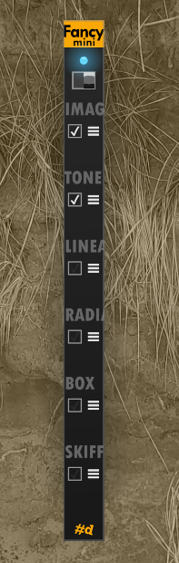
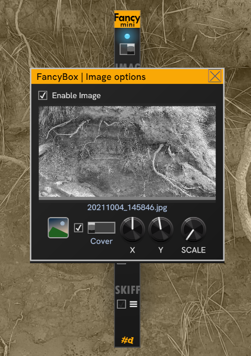
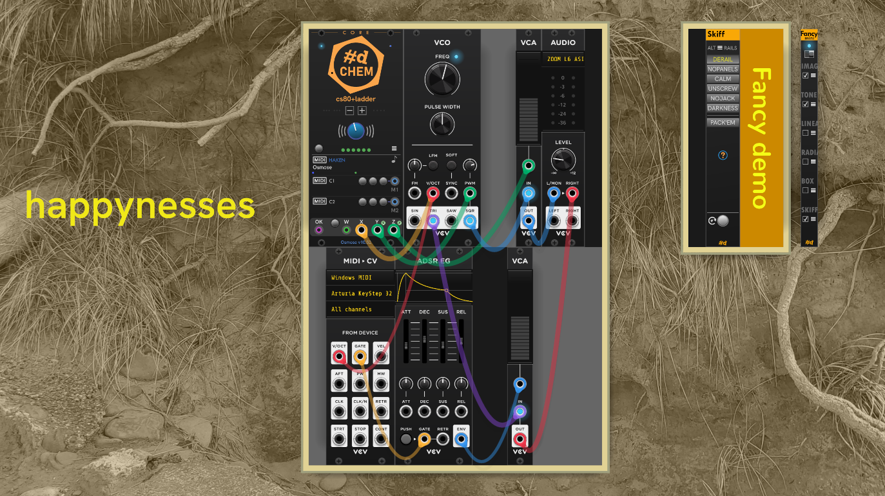
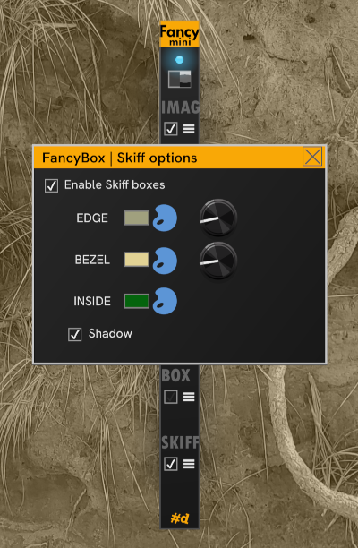

# FancyBox

**FancyBox** provides ways to modify or add interest to the Rack background.

| FancyBox Open (showing ports) | FancyBox Closed |
| :--: | :--: |
|  |  |

You can think of FancyBox as a twist on the legendary [DanT:Purfenator](https://library.vcvrack.com/DanTModules/Purfenator).
FancyBox and Purfenator can even be used together, when properly configured and placed in the patch in the right order.
It's pretty fiddly to get the combination to work, becuase they both do intrusive things that Rack wasn't really designed for, but it's possible.
But now that FancyBox has Skiffs, there isn't much need to combine them.

FancyBox supports up to 6 layers, the top 4 can be animated.
Each additional layer appears on top of the others.

When first added to Rack, only *TONE* is enabled, and the effect is not visible until you click the *ON•OFF* button or switch (Mini).
Click the check box above the vertical layer label to enable that layer.
Except for the *Image* and *Skiff* layers, all available options are on theFancyBox panel. on FancyBox Mini all other options are in the option dialogs accessed from the hamburger menus.

## Fancy layers

The layers in order from bottom to top:

- **Image** — A background image displayed below all modules and above the rails.

  - Select from image formats supported by Rack.
  - You can select the image directly from the panel by clicking the picture button or click the hamburger to open the Image options dialog box.

- **Fill** — A simple color fill of the Rack window below the modules.

  - An opaque color can be used for color-keying with video software like OBS.
  - A transparent color can be used to tone the visible rails.
  - If you'd like to tone module panels also, check out **[Paneltone](./PanelTone.md#paneltone)**.

- **Linear gradient** — A single animatable linear gradient overlay.

- **Radial gradient** — A single animatable radial gradient overlay.

- **Box gradient** — A single animatable  box gradient, which provides a nice vignetting effect.

- **Skiff** — Frames around grouped modules with drop-shadows. In **FancyBox**, you can find Skiff options on the module right click menu (there wasn't enough room on the panel ;-)

Most effects are simple applications of nanovg operations. Nanovg is the vector graphics library underlying the VCV Rack UI.

CV inputs can control the Hue, Saturation, Lightness and Alpha (opacity) components of each color, along with an additional fade for taking the color/effect in and out, leaving the color's opacity as the baseline. Each color has a row of HSLA+Fade inputs.

The inputs for other parameters of an effect are in the rows below the color(s).
Locations and lengths, like the ends of a linear gradient, or the center and radius of a radial gradient are expressed as a percentage of the width/height of the rack window.

If a static background is sufficient, you can take less space and collape the panel of input jacks by clicking the "plug" icon.
But if any cables are connected, you can't close the jack panel. You don't want to damage your plugs!
If you decide you want to animate the background effects, expand the panel and plug in some modulation.

A fast and full range signaal can generate exaggerated and flashing effects.
A bipolar signal with a limited range provides more tasteful results, so when using an LFO, set it to bipolar mode and use an attenuator (VCA) to limit it's range.
In this usage, you may want to set the other parameters to be somewhere in the middle range, so that the modulation isn't clipped at the end of the range for a parameter (unless you _want_ that effect :-).

## FancyBox Mini

| **FancyBox Mini** | |
| :--: | :-- |
|  | FancyBox Mini is a sleek and slender 2-hp version of FancyBox, without the CV animation inputs. Click a hamburger menu for the layer options. |

FancyBox Mini has the exact same module behind the UI as FancyBox, and so the same features.
Mini simply doesn't expose the automation inputs, and it's a slim 2-hp so it's far less visually intrusive to the Skiff.

## FancyBox Image options

Click the hamburger for more Image options. The dialog and iamge features are identical between FancyBox and FancyBox Mini.

- Click the *Open image* picture button to select an image file.

- The *Gray* check box next to the image button will convert the image to luminance grayscale for display. This is particularly effective combined with with the *TONE* layer.

- The *Image fitting* switch provides 4 options for fitting the image:

  - *Cover* (default) — The image is scaled just enough to cover the background.
  - *Fit* — The image is centered and scaled to fit within the Rack window.
  - *Stretch* — The image is stretched to fill the window. This changes the proportions of the image, which can work nicely for abstract graphics or images, but doesn't work as well for photos.
  - *Scale*  — The image is scaled according to the *Scale* knob on the right.

- The X and Y knobs provide a positive or negative offset to fine-tune the position of the image after scaling.
  Units are in percentage of the image size for the corresponding dimension.

- The *Scale* klnob provides the scaling factor when *image fitting* is *Scale*.*

## FancyBox Skiff options

_(New in version 2.5)._

This sample of Skiff in use demonstrates a few characteristics of FancyBox Skiffs.
The "happynesses" text on the left is a **#d One:Info** with the branding off and the background set to transparent. Note that this Info and the FancyBox Mini on the far right don't have cases. FancyBox doesn't put isolated single modules into a case.

A maximum 1-hp gap is allowed between modules in a given case. If you want larger gaps between modules in a case, you can do what is done here using the **#d One:Null** blanking plate.
Here, there is a transparent Null without branding between the VCO and the VCA, and an opaque dark one to the right of Audio.

The available options for Skiffs are in the dialog:

There are three componets to a skiff: the outer edge, the bezel, the inside of the case, and a drop shadow.
The palette buttons let you choose a color. The swatch next to the palette shows the current color. The color can be transparent.

The knob to the right controls the width of the edge or bezel.

The drop-shadow can be enabled or disabled from the _Shadow_ check box.

You can acheive a lot of skiff customization by combining the powers of modules in the #d One suite: FancyBox, Skiff, Info, and Null.

## Keep the background after removing FancyBox

FancyBoxes support leaving the static background in place after the FancyBox is removed from the patch.
This is unusual for a Rack module, but allows you to set up a specific look for recording or performance, and not have FancyBox cluttering your patch.

To enable retaining background effects after FancyBox is removed, toggle *Keep effects when removed* in the module menu.

You can add a FancyBox back and toggle the effects off or revert the patch to go back.
When this is enabled and you delete FancyBox, all the settings are lost when the patch is unloaded, so if you want to use this workflow, you can save a Preset to apply the same settings in the future. Unfortunately Rack doesn't support presets across modules even when the module under the UI is the same.

You can always just move FancyBox off screen, but this isn't always what you'd like for recording or performance.

## The One and only

FancyBox makes changes that are global to rack, so it makes sense to only have one instance in your patch.
If you add a second instance, it will be a nonfunctional one that looks something like this (varies by theme):

---

