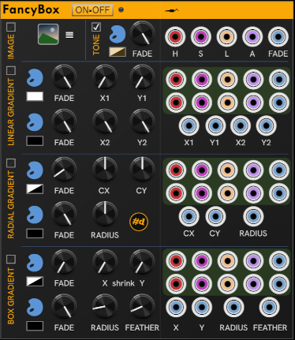
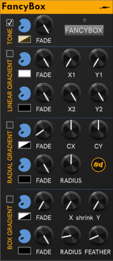
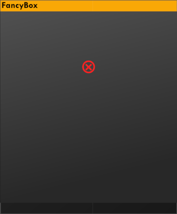

# FancyBox

**FancyBox** provides ways to modify or add interest to the Rack background.

| FancyBox Open (showing ports) | FancyBox Closed |
| :--: | :--: |
|  | |

You can think of FancyBox as a twist on the legendary [DanT:Purfenator](https://library.vcvrack.com/DanTModules/Purfenator).
FancyBox and Purfenator can even be used together, when properly configured.

FancyBox supports up to 4 layers, each with a simple graphic effect which can be animated.
Each additional layer appears on top of the others.

In order from bottom to top:

- **Fill** — A simple color fill of the Rack window below the modules.

  - An opaque color can be used for color-keying with video software like OBS.
  - A transparent color can be used to tone the visible rails.
  - If you'd like to tone module panels also, check out **[Paneltone](./PanelTone.md#paneltone)**.

- **Linear gradient** — A single linear gradient overlay.

- **Radial gradient** — A single radial gradient overlay.

- **Box gradient** — A single box gradient, which provides a nice vignetting effect.

These effects are all simple applications of nanovg operations.

CV inputs can control the Hue, Saturation, Lightness and Alpha (opacity) components of each color, along with an additional fade for taking the color/effect in and out, leaving the color's opacity as the baseline. Each color has a row of HSLA+Fade inputs.

The inputs for other parameters of an effect are in the rows below the color(s).
Locations and lengths, like the ends of a linear gradient, or the center and radius of a radial gradient are expressed as a percentage of the width/height of the rack window.

If a static background is sufficient, you can take less space and collape the panel of input jacks by clicking the "plug" icon.
But if any cables are connected, you can't close the jack panel. You don't want to damage your plugs!
If you decide you want to animate the background effects, expand the panel and plug in some modulation signals.

## The One and only

FancyBox makes changes that are global to rack, so it makes sense to only have one instance in your patch.
If you add a second instance, it will be a nonfunctional one that looks something like this (varies by theme):

---

