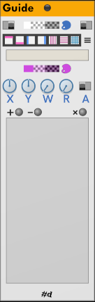
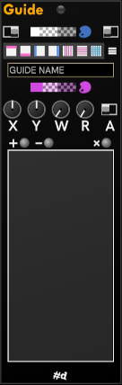
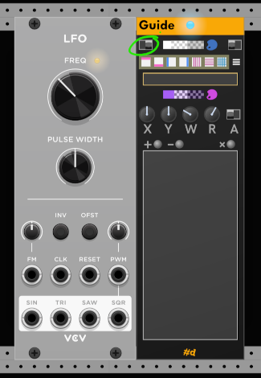
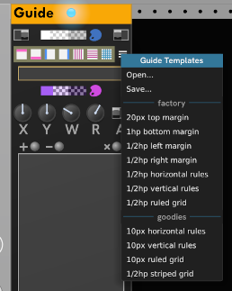
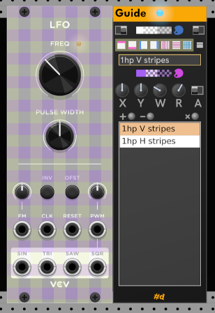

# Guide

This one is for plugin developers.
Place **Guide** to the right of a module you're working on.
It works very much like an extender for the panel on the left.
When immediately to the right of a module, **Guide** adds an overlay to the module to screen the panel and display guides.
You can adjust the transparency of the overlay using the top palette button.

| Light | Dark| High Contrast |
| :-: | :-: | :-: |
| | | |

## Guide in Action

Here, we've placed Guide to the right of a VCV LFO, and turned it on using the _On/Off_ switch, circled top left.
The light in the Guide title bar is turned on when Guide is active.

We haven't added any guides to the list yet, so all that we see is the module screen.

To the right of the _On/Off_ switch is a preview swatch for the overlay color, a palette button for modifying the overlay color and transparency, and the _Position_ switch.
The swatch, from left to right shows the color in 1) Opaque (no transparency) 2) with transparency over white and 50% gray checkerboard 2) with transparency over black and  50% gray checkerboard.
Click the palette button to display a color picker.

With the _Position_ switch, you can choose from covering only the panel, or also covering the knobs, plugs, and other widgets on the panel.
When widgets are covered, you can no longer interact with the module.

The next row is a selection of pre-made guides you can add.
From the hamburger menu at the end of the row of templates, there is a selection of additional factory templates, and you can _Save_ your guide setup to a file or _Open_ a previously made one.

Here's what it looks like when we've added the factory _1/2hp striped grid_ template:

Templates are additive, so you can build up a combined set of guides.

## Defining your own guides

The edit box below the templates lets you provide a descriptive name for a guide.
If you leave it empty, **Guide** names it for you when you click **+** to add it the list.

In the next row is a preview swatch and picker for the color of the guide. All the factory guide templates have transparency.

To edit an existing Guide, select it in the list.
To stop editing the selected guide, click in a blank area to de-select it.

The knobs control the parameters of a guide.

A knob can be less than pixel-perfect-precise, so we can take advantage of the fact that these are standard Rack parameters and right-click the knob to enter an exact value.

|Knob/Switch|Description|
| :-: | - |
| X | X position of the guide. A negative value is the offset from the right edge. Used for right margin. |
| Y | Y position of the guide. A negative value is the offset from the bottom. Used for bottom margin. |
| W | Width of the guide. |
| R | Repeat interval. The guide is repeated every _R_ pixels across the panel. |
| A | Angle switch. Arbitrary guides are on the wish-list, but for now only horizontal and vertical guides are supported. |

| Button | Decription |
|:-:| -- |
| **+** | Adds the current configuration as a guide. |
| **-** | Removes the currently-selected guide from the list. |
| **x** | Clears the entire list. |
