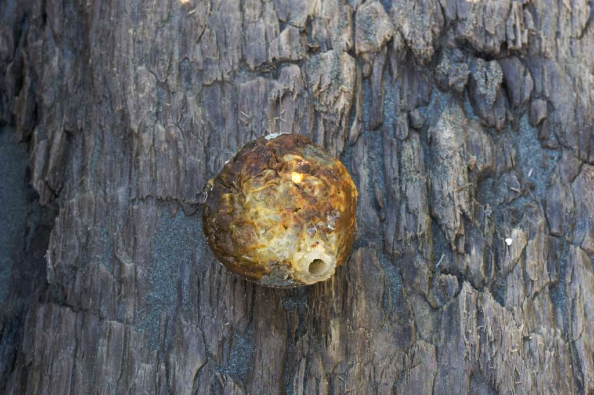
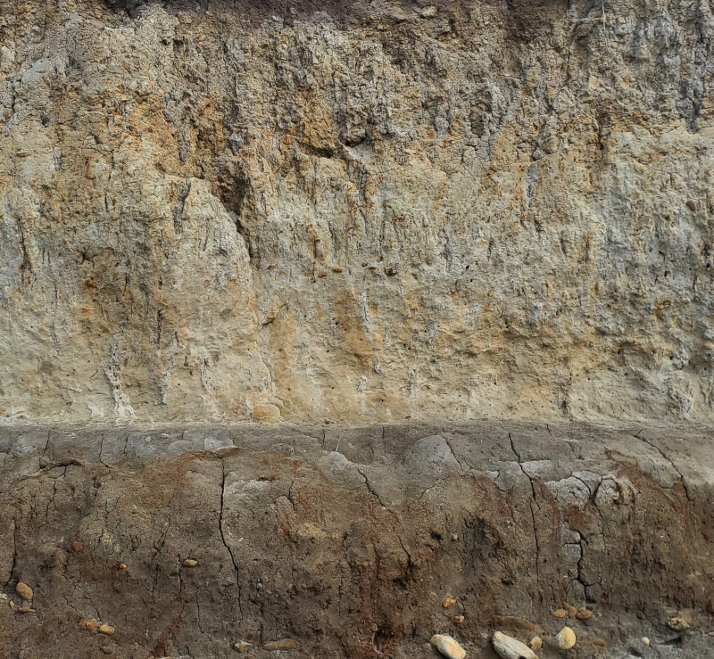

# Imagine

An unique and perhaps eccentric source of volage, gates, and triggers using an image.
You can think of it as a sequencer or image sampler.

**See also:** [All pachde-One modules](index.md)

Load an image and generate voltages, gates, and triggers as the image is scanned by a read head.
Click on the image to set the position of the read head.
Drag to scrub.

Try out the images available with the factory presets.
Or download the [Imagine-Demo-1](https://patchstorage.com/imagine-demo-1/) patch from **patchstorage**.

## Features

- All knobs are clicky knobs.
Click on a knob to increment the value by a useful unit.
Ctrl+Click to decrement (Cmd+Click on Mac).
Hold down Shift for 10x the un-shifted amount.

- Select an image using the **Picture** button, or drag and drop the image file onto the image area.

- Start and stop the read head with the **Play/Pause** button, or send a trigger to the violet **pp** input port.

- Press the **reset** button, or send a triggger to the **r** input port to reset the read head to it's default position.
  Shift+Click to set the default psoition to the current position.

- Adjust the speed of the read head with the **speed** knob.
  The **x?** knob next to speed multiplies the speed by **x1** - **x10** times.

  While there is a lot of room to go very fast, some of the best results may be obtained by slowing it down to speeds less than one.
  Right click to enter precise small values.

- If the output is too janky for you, smooth it out with a higher **slew** rate.

- Choose the color component from the read head to output to **v**oltage and analyze for **g**ates and **t**riggers.
  The knob has a dynamic label that shows the selected color component:

  | Component | Description |
  | -- | -- |
  | **L** | Lightness |
  | **Lu** | Luminance |
  | **S** | Saturation (chroma) |
  | **H** | Hue |
  | **min** | Minumum of R, G, B |
  | **max** | Maximum of R, G, B |
  | **ave** | Average of R, G, B |
  | **R** | Red component |
  | **G** | Green component |
  | **B** | Blue component |
  | **a** | Alpha (transparancy) |

  Alpha isn't useful for most images.
  Only PNGs with transparency will have an effect:
  everything else will ouput a steady maximum voltage for Alpha.

- Set the threshhold for gates and triggers with the **g/t** knob. Low values are very sensitive.
  If you're getting too many too fast, set a higher threshhold or slow the read head down.

- Choose a **path** to move through the image:

  | Path | Description |
  | -- | -- |
  | **Scanline** | Simple left-to right, top to bottom scan, like a television or video display. |
  | **Bounce**   | Travel in straight lines and bounce at the edges. Bounces are randomly very slightly askew from a perfect reflection, so you don't get stuck in the same orbit. |
  | **Vinyl**    | (my favorite) Spin in like a record (baby): spin it right round; then spin back out. |
  | **Wander**   | Just wander around the image to see what you can find. |
  | **XY Pad**   | No automatic movement of the read head. Reads from where you click. Drag the mouse to scrub. With a carefully prepared image, you can get specific voltages for controlling a patch. |
  | **Tabalar** | Top-to-bottom, left-to-right. |
  | **Ralabat** | Right-to-left, bottom-to-top |

  The selected path is shown in the backlit text display in the middle of the panel.

  To use Imagine as an plain XY Pad, set **path** to **XY Pad** without an image.
  To close an image after you've opened one, cancel out of the **Open image** dialog.

- Imagine has a variety of outputs.
Raw outputs for **x**, **y**, and unipolar pixel **R**, **G**, and **B** values are on the left,
and computed outputs for **v**oltage **g**ate and **t**rigger to the right.

  X/Y outputs from the X/Y Pad follow the Polarity (**p**) switch to select from Unipolar positive offsets from top-left to Bipolar Cartesian coordinates.

- Choose polarity of voltage ouput with the  Polarity (**p**)  switch.
Switches computed outputs between -5 to +5v (bipolar) and 0 to 10V (unipolar).
Also sets the coordinate system for the XY Pad.

## Inputs

| Input | Description |
| -- | -- |
| speed | The left violet-colored port controls the speed of the read head. |
| x/y | The peach-colored ports are unipolar CV control of read head position overrides the path, speed, and multiplier knobs. Both inputs must be connected to control the read head. |
| r | The lime-colored port is a unipolar trigger for read head reset to its default starting position. |
| pp | The right violet-colored port is a unipolar trigger that toggles Play/Pause of the read head. |

## Outputs

| Output | Description |
| -- | -- |
| x/y | x/y coordinates of the read head. Follows the polarity of the Polarity switch. |
| R, G, B | Raw Red, Green, and Blue components at the read head. |
| v | Voltage of the selected color component. |
| g | Gate based on analyzing v. Use g/t to adjust sensitivity. |
| t | Trigger based on analyzing v. Use g/t to adjust sensitivity. |

## Menu options

| Option | Description |
| -- | -- |
| Screws | Add or remove the screw caps. |
| Theme | Choose Light, Dark, or High Contrast theme. Choose whether to follow the Rack **Use dark panels** option, and which theme is applied when the option is selected. You can even be a rebel (or silly) and choose **Light** as the theme used when **Use dark panels** is selected. Who am I to judge? |
| Labels | Show labels on controls and jacks, or hide all text for a clean look. |
| Gold medallion | Show the gold **#d** brand medallion, or hide it if it's a bit too bold for you.   |
| Bright image in a dark room | Keep the image bright when it's dark. |

## Factory presets

| Preset | Description |
| -- | -- |
| clean-bright-light | Clean panel in Light theme with no screws or labels. The image is bright in a dark room. |
| clean-bright-dark | Clean panel in Dark theme with no screws or labels. The image is bright in a dark room. |
| clean-bright-high-contrast | Clean panel in High Contrast theme with no screws or labels. The image is bright in a dark room. |
| default-ui | Factory default UI settings. |

### Image presets

Imagine includes a few sample image presets to try things out with.

| Preset | Notes | Image |
| -- | -- | -- |
| **Sampler** | Try scrubbing or letting Scanline run across a barcode. The QR codes are working links. The barcodes and QR codes were created with the Inkscape Barcode extension. |  |
| **Burning-balloon** | A digital painting |  |
| **fields** | A digital painting |  |
| **Guitar-shirt** | pachde's favorite guitar shirt |  |
| **Mica** | A digital painting |  |
| **Monkey** | A digital painting |  |
| **Sandstone** | Chuckanut sandstone erosion texture from Waldron island. This one is manipulated to have both smooth transitions (at low speeds) and sudden jumps. |  |
| **Seaweed** | Photo from the beach. |  |
| **Stratus** | Eroded bluff face on a US Pacific beach. |  |

The images are free for use with Imagine: [Check the license](../presets/images/LICENSE.txt).

