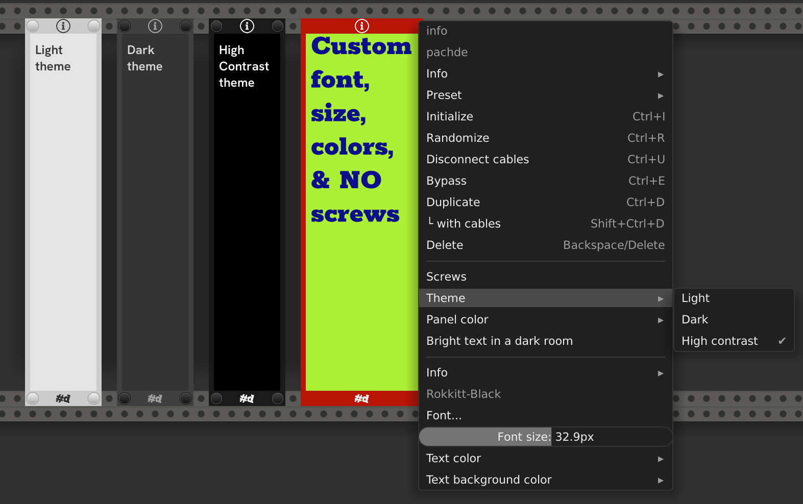

# Info

A Minimalist resizable patch notes panel.

**See also:** [All pachde-One modules](index.md)

Here are some samples with Light, Dark and High Contrast themes, and selected options.

- Resizable - Drag the left and right edges when the overlay appears under the cursor.

## Options

| Option | Description |
| -- | -- |
| Screws | Add or remove the screw caps. |
| Theme | Choose Light, Dark, or High Contrast theme. |
| Panel color | Enter a standard Rack #_hex_ code for a custom color to override the theme. Even the screw caps adopt your color!. You can copy/paste the hex code from Copper. |
| Bright text in a dark room. | The text and text background stay bright in a darkened room. |
| Edit Info > | Edit the info displayed on the panel. Use the standard Rack text input to add text. |
| Copy info | Copy the info to the clipboard. |
| Paste info | Paste the info from the clipboard. |
| Font... | Open a Truetype font (.ttf) to use for the text. The name of the font file current used appears above this item. |
| Font size | Pick a size for the text using the standard Rack slider. |
| Text alignment | Choose **Left**, **Center**, or **Right**-aligned layout. |
| Text color  | A standard Rack #_hex_ code for the color of the text. |
| Text background color  | A standard Rack #_hex_ code for the color of the text|
| Copper | Choose which colors the Copper extender module sets. Choose from **Panel** or **Interior**. When set to **Interior**, choose a Background color from a Copper on the left, and Text color from a Copper on the right. |

## Fonts

Any Truetype font can be used. There are thousands of free fonts available for download on the web.
[Google Fonts](https://fonts.google.com/) has some nice ones.

On Windows, it can be difficult to browse to a font in the windows font folder:
the file browser doesn't show the actual .ttf files, but there's a trick.
You can get to the actual file path you need from a regular Windows command prompt.
Start a command prompt and type `dir /S /B c:\windows\fonts\*.ttf`, copy the full path of file,
then paste it into the Font chooser dialog.

## Extender

[Copper](Copper.md) extends Info to set it's panel, background, and text colors.
By default Copper sets the panel color.
In the menu, choose **Interior** for Copper, and now Copper changes the text background when it's on the left, and the text color when it's on the right.
Two Coppers can work simultaneously in this configuration.

You can have some fun turning on the **Bright text in a dark room**, setting **Copper** to **Interior**, putting a modulated Copper on either side, and turn down the lights.

