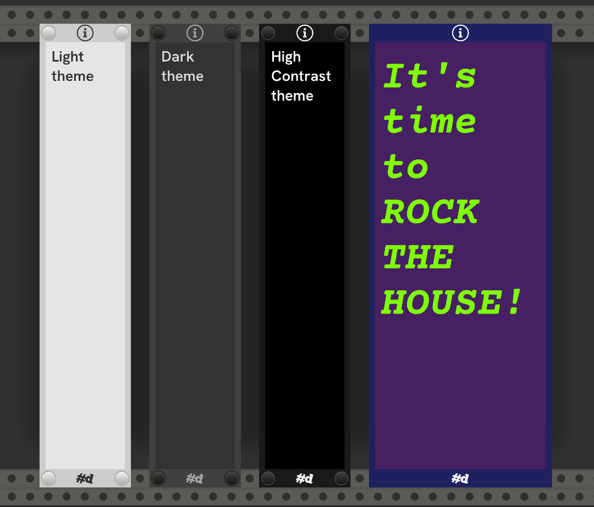
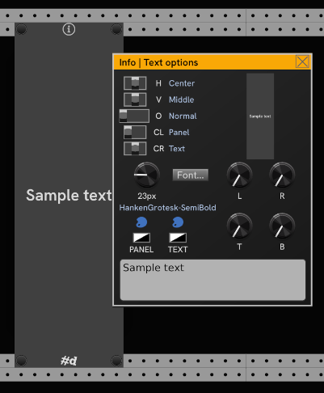

# Info

A Minimalist resizable patch notes panel.

Here are some samples with Light, Dark and High Contrast themes, and selected options.



Info is resizable — Drag the left and right edges when the overlay appears under the cursor.

## Options

In 2.3, the available options for displaying taext have been expanded and are now set in the _Text options_ dialog box.
You can open the dialog from the right click menu, or click the _Info_ symbol in the title bar.



The dialog is offset from the panel so it doesn't completely obscure the module.
It shows a 1/4-scale preview of the text formatting on the upper right.

Alignment, orientation, and Copper options are set with the switches on the left:

| Option | Setting | Description |
| :--: | -- | -- |
| H | Horizontal Alignment | _Left_, _Center_, or _Right_-aligned text. For _Center_, left and right margins are ignored. |
| V | Vertical Alignment | Text can be placed at the _Top_, _Middle_, or _Bottom_ |
| O | Orientation | Choose from _Normal_ (left to right), _Up_ (bottom-to-top), _Down_ (top-to-bottom), or _Inverted_ (upside-down) orientations. |
| CL | Copper-Left | When a Copper(-mini) in extender mdoe is on the left, it can change the  _Panel_ or the  _Text_ color. _None_ ignores any Copper on the left. |
| CR | Copper-right | Like _CL_, only for a Copper(-mini) on the right. |

Using a Copper allows you to animate the panel and text colors with CV from other modules.

Use the _Font Size_ knob to dial in the size of the text.
Remember that you can right click a knob to type in an exact value.

The _Font..._ button presents a file browser to choose a font file.
More on [Fonts](#fonts) below.

The _L_ _R_ _T_ _B_ knobs control the Left, Right, Top, and Bottom margins.
In some alignment modes, one or more of the margins may be ignored.

The Palette buttons displayu a color picker to choose a color for the panel or the text.
Translucent panels make great additions to a patch.

## Right click menu

You'll find the following options in the right-click menu:

| Option | Description |
| -- | -- |
| Text options... | Display the _Text options_ dialog box for configuring the panel and text display and Copper-extending behavior. |
| Screws | Add or remove the screw caps. |
| Theme | Choose Light, Dark, or High Contrast theme. |
| Bright text in a dark room. | The text and text background stay bright in a darkened room. |
| Copy info | Copy the info to the clipboard. |
| Paste info | Paste the info from the clipboard. |

## Fonts

Any Truetype font can be used. There are thousands of free fonts available for download on the web.
[Google Fonts](https://fonts.google.com/) has some nice ones.

On Windows, it can be difficult to browse to a font in the Windows font folder because the file browser doesn't show the actual .ttf files.
But there's a trick:
You can get to the actual file path you need from a regular Windows command prompt.

Start a command prompt and type:

```console
dir /S /B c:\windows\fonts\*.ttf
```

Copy the full path of file, then paste it into the Font chooser dialog.

## Expander

[Copper](./Copper.md#copper) and [Copper-mini](./Copper-mini.md#copper-mini) are able to extend **Info** to set it's panel and text colors.
Configure what happens with an extending Copper in the left/right extender position in the _Text options_ dialog.
In the Coppers, you must enable _Enable sharing color as Extender (F2)_ option.
With a Copper installed, you can use CV to animate the panel and text colors of the Info.

---


