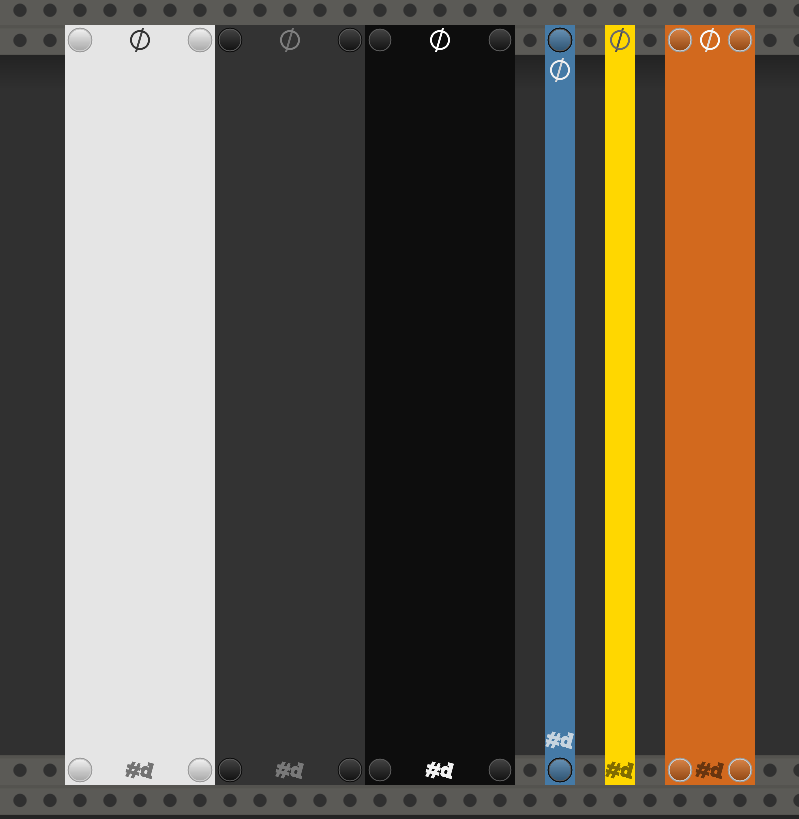

# Null

A truly blank, blank panel, with some fun features (for a blank panel).

**See also:** [All pachde-One modules](index.md)

Here's a sampling of Null in Light, Dark, and High Contrast themes and various colors, widths, and options:

- Resizable - Drag the left and right edges when the overlay appears under the cursor.

## Options

You'll find the following options in the right-clcik menu:

| Option | Description |
| -- | -- |
| Screws | Add or remove the screw caps. |
| Theme | Choose Light, Dark, or High Contrast theme, or to follow Rack settings. |
| Palette color | Choose the background color from a palette of named colors. |
| Background | General color picker for the background |
| Copper sets panel color | Control whether to allow a Copper or Copper-mini to set the panel color. |
| Show branding | Toggle the visibility of the title symbol and **#d** logo. |
| Brand logo | Toggle showing the **#d** logo when branding is shown. |
| Glow in the dark. | The panel stays bright in a darkened room, with a glow that follows VCV Rack's Light bloom setting. |
| Bright in a dark room | Panel is not dimmed when the lights are down. |

## Inputs

Null has a "secret" input port.
Plug a signal into the **Flicker** port hidden behind the **#d** logo to add flickering to the panel, like a neon sign going bad or a defective flourescent light.

## Expander

When the _Copper sets panel color_ option is turned on,
**[Copper](./Copper.md#copper)** and **[Copper-mini](./Copper-mini.md#copper-mini)** can extend **Null**, setting the panel color to the color chosen.
In Copper(-mini), you must enable color sharing in the right-click menu, with _Share color as Extender (F2)_.
Null remembers that color, so you can remove Copper from the patch after you're done.
Or, leave Copper in the patch, and modulate it to animate the Null color.

The most exciting visuals for **Null** is when you turn on _Glow in the dark_, animate the color using a Copper, and plug a signal into the **Flicker** port.

---

