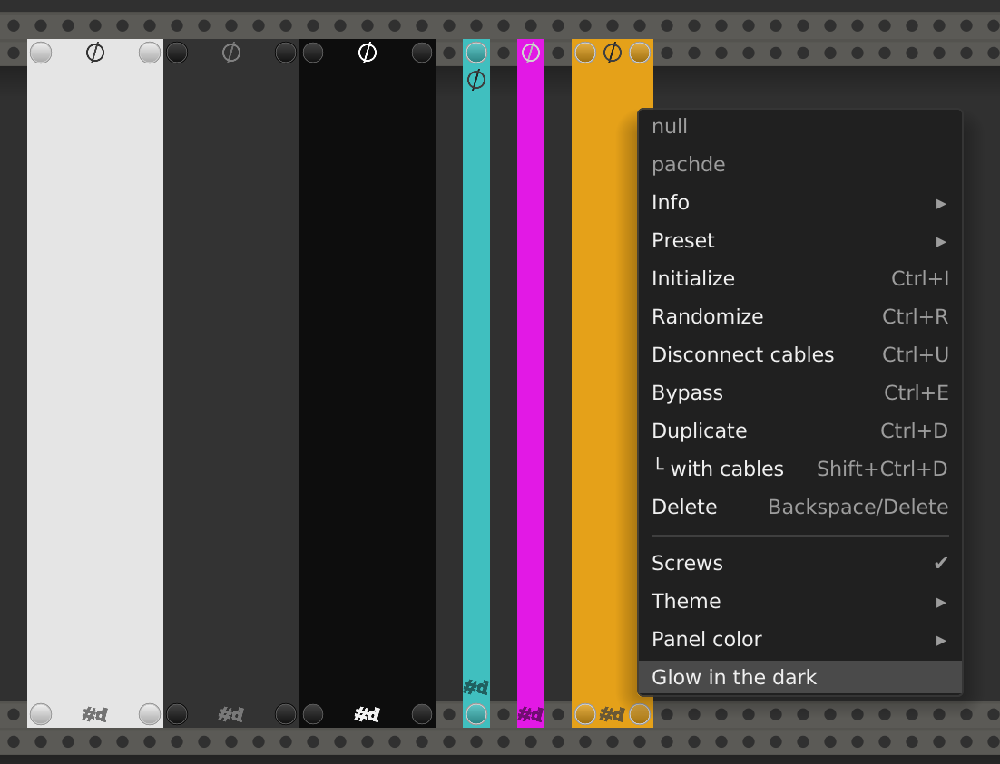

# Null

A truly blank, blank panel, with some fun features (for a blank panel).

**See also:** [All pachde-One modules](index.md)

Here's a sampling of Null in Light, Dark, and High Contrast themes and various colors, widths, and options:

- Resizable - Drag the left and right edges when the overlay appears under the cursor.

## Options

| Option | Description |
| -- | -- |
| Screws | Add or remove the screw caps. |
| Theme | Choose Light, Dark, or High Contrast theme. |
| Panel color | Enter a standard rack #_hex_ code for a custom color to override the theme. Even the screw caps adopt your color!. You can copy/paste the hex code from Copper. |
| Palette color | Choose color from a palette of named colors. |
| Glow in the dark. | The panel stays bright in a darkened room, with a glow that follows VCV Rack's Light bloom setting. |

## Inputs

Null has one secret input port.
Plug a signal into the **FLicker** port hidden behind the **#d** logo to add flickering to the panel, like a neon sign going bad or a defective flourescent light.

## Expander

**[Copper](copper)** extends Null, setting the panel color to the color chosen.
If you haven't memorized the hex codes for colors you want to use, drop a Copper next to Null and pick a color.
Null remembers that color, so you can remove Copper from the patch after you're done.
Or, leave Copper in the patch, and modulate it to animate the Null color.

The most exciting visual for Null is to turn on **Glow in the dark**, animate the color using Copper, and plug a signal into the **Flicker** port.

