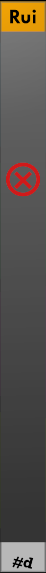

# Rui

**Rui** provides nice knobs with control voltage inputs for:

1. Cable opacity (cyan)
1. Cable tension (green)
1. Room brightness (magenta)
1. Light bloom (yellowish-green)

The Pause/Play button at the botttom lets you pause the Rack changes.

Add some gentle LFO modulation for a pulsing rack.
By default, modulation amount is zero.
Turn up the trim pot to increase the amount of CV modulation.

**Rui** comes in thre themes: Light, Dark, and High-contrast.

| Light | Dark| High |
| :-: | :-: | :-: |
| | | |

## The One and only

Rui makes changes that are global to rack, so it makes sense to only have one instance in your Rack.
If you add a second instance, it will be a nonfunctional one that looks something like this (varies by theme):

---

