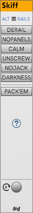
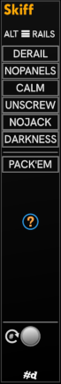

# Skiff

**Skiff** provides some neat ways to customize the look of your rack.
It comes in three themes: Light, Dark, and High-Contrast:

| Light | Dark| High |
|:-: | :-: | :-: |
| | | |

1. **Change rail** — The hamburger menu at the top contains a selection of alternate rails for your rack. Or you choose a custom rail SVG of your own.
  Some SVGs don't work, but most will display fine.
  The provided alternate rail SVGs have the identical size of Rack's rail SVGs, but that isn't required for a custom one.

1. **Derail** — Toggles between Rack's rails visible and invisible (black).

1. **Calm knobs and ports**  — Toggle between standard Rack black knobs and i/o ports and calm ones that are less glossy and ornate.
  The effect is a bit subtle.

1. **Unscrew** — Unscrew all modules in the Rack.
  If modules start falling out, you can click it again to restore the screws.
  Only standard Rack screws are affected.
  I don't have the right screwdriver for the custom screws that some modules use.
  Other #d One come with their own screwdriver in the module menu.

1. **Pack modules (F7)** — Pack your modules together in neat, left-aligned rows.
  Works on just the selection if you have one.
  Any vacant rows are filled.
  Modules in a given row are kept together in the same row to avoid breaking extenders.

1. **Appply last saved skiff** —
   Skiff remembers it's last settings, but doesn't apply them when restarting Rack or opening the patch.
   This is to avoid suprise behavior that can make Rack seem broken until you realize a **Skiff** is in there.
   If want those settings, hit this button after startup to apply the last look.
   Sometimes if other things have changed, it won't completely work.

   Saving presets in the module menu works better. These are well-behaved and always work immediately when selected from the menu.

1. **Zoom to selection** (no button). Press **F6** with the mouse over **Skiff** to zoom the selected modules.

## The One and only

Skiff makes changes that are global to rack, so it makes sense to only have one instance in your Rack.
If you add a second instance, it will be a nonfunctional one that looks something like this (varies by theme):

---

