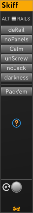

# Skiff

**Skiff** provides some neat ways to customize the look of your rack.
It comes in three themes: Light, Dark, and High-Contrast.
Change themes and turn off the SHOUTING button labels in the module menu.

| Light | Dark| High | NOT SHOUTING (Dark) |
|:-: | :-: | :-: | :-: |
| | | | |

1. **ALT RAILS** — The hamburger menu at the top contains a selection of alternate (themed) rails for your rack.

   Or, you choose a custom rail SVG of your own.
   SVGs seem to work best when they are a multiple of HP units (15 pixels) wide and at least 380 pixels high.
   The provided alternate rail SVGs have the identical size of Rack's rail SVGs, but that isn't required for a custom one.

   Alternate rails come in the usual selection of Light, Dark, and High Contrast themes.
   You can set a specific theme explicitly or follow the _Rack UI theme_ or the _Prefer dark panels_ option.

1. **DERAIL** — Toggles between rails visible and invisible (black). Applies equally to Rack rails and Skiff rails.

1. **NOPANELS** — Toggle between hidden and visible module panels.
   Panels are see-through when hidden, except for their knobs, ports, displays, and other added widgets.

1. **CALM**  — Toggle between standard Rack black knobs and I/O ports and calm versions that are less glossy and ornate.
  The effect is a bit subtle, but nice.
  Select the alternate plugged-in Jack style in the module right click menu.

1. **UNCREW** — Unscrew all modules in the Rack.
  If modules start falling out, you can click it again to restore the screws.

   I don't have the right screwdriver for the custom screws that some modules use, so only standard Rack screws are affected.

   **#d One** modules that have screwcaps come with their own screwdriver in the module menu.

1. **NOJACK** — Hide and show unused jacks. When unused jacks are hidden, you can't plug in new cables.
   The action is not continuous, so if you unplug a port it remains visible.

1. **DARKNESS**  — Quell das blinken lights (toggle between hidden and visible lights).

1. **PACK'EM (F7)** — Pack your modules together in neat, left-aligned rows.
  Works on just the selection if you have one.
  Any vacant rows are filled.
  Modules in a given row are kept together in the same row to avoid breaking extenders.

1. **Restore Rack** — Restore everything to default Rack apeparance with one click.

## Keyboard shortcuts

Hover the **?** icon to show keyboard tips. There, you'll see that you can:

1. **Zoom to selection (F6)** Press **F6** with the mouse over **Skiff** to zoom the selected modules.
   It's a puzzle that Rack doesn't do this itself.

1. **Pack selected modules (F7)** Press **F7** with the mouse over **Skiff** to pack the selected modules.

## The One and only

Skiff makes changes that are global to rack, so it makes sense to only have one instance in your patch.
If you add a second instance, it will be a nonfunctional one that looks something like this (varies by theme).
If Skiff appears like this, then you already have a Skiff elsewhere in the patch.

---

