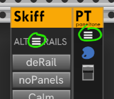

# pachde-One Modules for VCV Rack

| Module&nbsp;name | Description |
| -- | -- |
| **[Imagine](Imagine.md#imagine)** | An unique and eccentric source of voltage, gates, and triggers using an image as a source of signals. |
| **[Null](Null.md#null)** | A truly blank, blank panel with some fancy features (for a blank). |
| **[Info](Info.md@info)** | A minimalist resizable text notes panel. Now with vertical and upside-down orientations. Click the "i" icon for options, or use the module menu. |
| **[Copper](Copper.md#copper)** | A color picker with modulation and outputs. Expander for **Null**, **Info**, and **PanelTone**. |
| **[Copper-mini](Copper-mini.md#copper-mini)** | A compact 2HP version of Copper.  Expander for **Null**, **Info**, and **PanelTone**.  |
| **[Rui](Rui.md#rui)** | Knobs and control voltage for Rack cable opacity and tension, room brightness, and halo strength. |
| **[Skiff](Skiff.md#skiff)** | Customize your skiff with alternate rails, simplify knobs and ports, remove screws, hide lights, and hide unused jacks. Neatly pack all modules or a selection. Plus, zoom to selection. |
| **[PanelTone](PanelTone.md#paneltone)** | Tint the panels in your skiff. Animate the color with Copper. |
| **[FancyBox and FancyBox Mini](FancyBox.md#fancybox)** | Make the Rack background fancy with an image background, tint, linear gradient, radial gradient, and/or vignetted box, with CV-controlled animation. Now with Skiff boxes (version 2.5). Info, Null, and Skiff make great partners with FancyBoxes for laying out great-looking skiffs for sharing or recording videos. |
| **[Guide](Guide.md#guide)** | (For plugin developers.) Overlay the module to the left with design guides / grid, for help adjusting module layout. |

All **pachde One** modules have Light, Dark, and High Contrast themes.
You can choose independent themes, or set the theme for all #d One modules currently in the patch.
Youc an also follow the Rack UI theme, or the Rack _Prefer dark panels_ setting.
They also come with caps on the screws for an elegant look.
All #d One screws are removable if you're more relaxed about your Rack and don't worry about the modules falling out.
For your modules from other plugins, try the UNSCREW button in the new **Skiff** module.

Right click to choose a theme, add/remove screws, and additional options for the module.

Many **#d One** modules split their options between the module right click menu,
and a module-specific menu accessed from a Hamburger menu widget on the panel.
Here's a snip of the Humburger menu on the **Skiff** and **PanelTone** module:

## For developers

For developers, 2.3 and above includes demonstrations of hot-panel-reload (all new modules), SVG theming (all modules), a flyout panel (FancyBox), and options dialog boxes (Info, FancyBox, FancyBox Mini).

---

